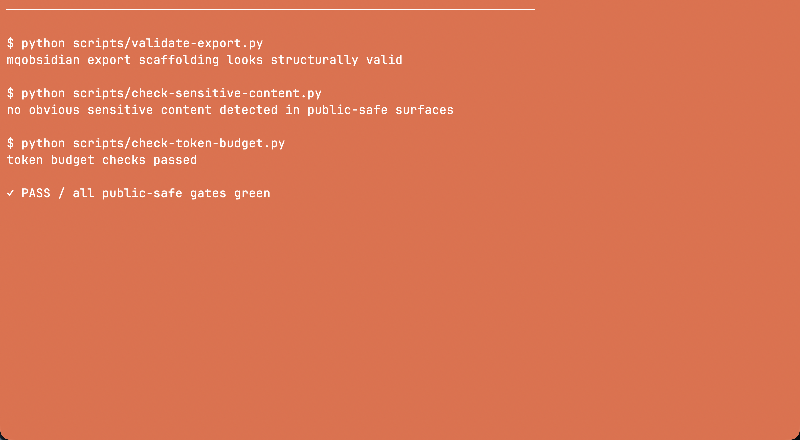
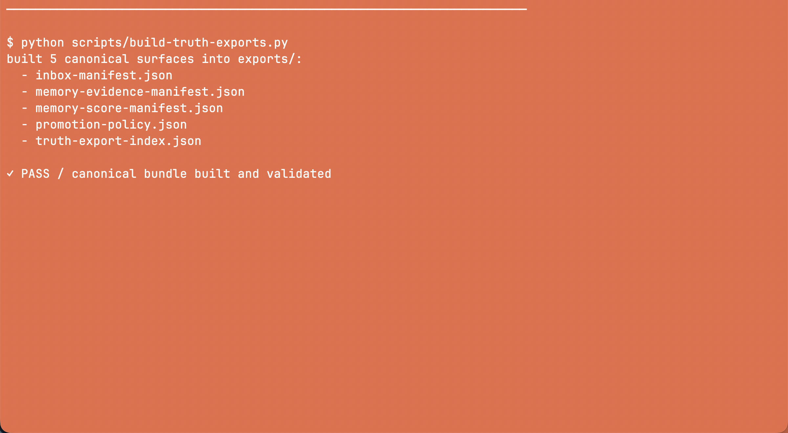

# mqobsidian

[](https://github.com/MCamner/mqobsidian/actions/workflows/public-safe-check.yml)
[](CHANGELOG.md)

Live site: <https://mcamner.github.io/mqobsidian/> — durable memory layer for the MQ stack.

`mqobsidian` stores reviewed, reusable, agent-readable knowledge. It reduces
token usage through better read order, smaller surfaces, and clear truth boundaries.

It is **not**:

- the execution runtime
- the orchestration engine
- the source of live code truth
- the place to dump raw logs by default

## What this repo is for

Use `mqobsidian` to:

- store durable memory from verified work
- keep compact context surfaces for agents
- reduce repeated broad scans of repo docs
- separate memory from live runtime truth
- define schemas, templates, and context rules for the stack

Use source repos and tools for current code behavior, current tests, current CLI
behavior, live review execution, and contracts in motion.

## Read order

When the task touches MQ memory, context, or prior stack work, read the smallest
useful surface first and stop once the task is grounded:

1. `.mq/context/task-pack.md`, but only when its `task` and `repo` match the current work; otherwise skip it or regenerate it
2. `memory/learn/agent/mqobsidian.md`
3. `systems/mqobsidian/hot.md`
4. `systems/mqobsidian/index.md`
5. relevant context cards or docs only when the smaller surfaces are insufficient

See [docs/CONTEXT_CONTRACT.md](docs/CONTEXT_CONTRACT.md) for the full rules.

## Truth boundary

`mqobsidian` stores durable memory. It does not replace live truth from
`mq-agent`, `mq-mcp`, `mq-hal`, `repo-signal`, `mq-ums`, or `mq-image-analyze`.
If the task depends on current runtime state, file behavior, tests, or review
execution, verify in the source repo or tool.

## Quick Start

```bash
python3 scripts/generate-context-pack.py \
  --task "fix mq-mcp brain writer paths" \
  --repo mq-mcp \
  --target codex \
  --out .mq/context/task-pack.md
python3 scripts/check-token-budget.py
python3 scripts/measure-context-effect.py
python3 scripts/generate-agents-md.py --all --output-dir examples/generated-agent-entrypoints
python3 scripts/generate-claude-md.py --all --output-dir examples/generated-agent-entrypoints
python3 scripts/generate-repo-context-export.py --all --clean
```

## Context Compression

The token-reduction path is:

```text
task -> memory query -> context-pack.v1 -> Codex / Claude Code
```

Current measured effect:

```text
context pack + cards: 222 lines
broad first-read baseline: more than 6,000 lines
reduction: more than 96%
```

See [docs/context-effect.md](docs/context-effect.md).

## Examples

See [examples/sanitized-context-pack.md](examples/sanitized-context-pack.md) for
a public-safe generated pack with explicit inclusions and exclusions.

## Demo

Run the context-effect measurement:

```bash
python3 scripts/measure-context-effect.py
```

Representative output (the broad baseline grows with the public docs):

```text
context_lines=222
broad_baseline_lines=6200+
reduction_percent=96.x
```




## Public-Safe Rules

Safe to publish: architecture notes, ADRs and decisions, schemas and templates,
sanitized reviews, examples, and truth exports.

Do not publish: secrets, tokens, or API keys; customer names or internal
hostnames; IP addresses or raw enterprise logs; machine-specific private paths;
unsanitized review output.

## Key docs

- [docs/CONTEXT_CONTRACT.md](docs/CONTEXT_CONTRACT.md) — how agents should read and use mqobsidian
- [docs/TOKEN_BUDGET.md](docs/TOKEN_BUDGET.md) — size limits for agent-readable context surfaces
- [docs/CONTEXT_CARDS.md](docs/CONTEXT_CARDS.md) — small reusable context-card model
- [docs/context-export-contract.md](docs/context-export-contract.md) — `.mq/context` export ownership and budget source
- [docs/memory-model.md](docs/memory-model.md) — durable memory layers and ownership
- [docs/truth-export.md](docs/truth-export.md) and [docs/ROUTING_OUTCOMES.md](docs/ROUTING_OUTCOMES.md) — truth-boundary and verified routing storage
- [docs/roadmap-token-reduction.md](docs/roadmap-token-reduction.md) — longer roadmap
- [schemas/context-pack.v1.json](schemas/context-pack.v1.json) — task-pack schema
- [templates/context-pack.md](templates/context-pack.md) — task-pack template

## Validation

```bash
python3 -m pip install -r requirements.txt -r requirements-dev.txt
python3 scripts/validate-export.py
python3 scripts/check-sensitive-content.py
python3 scripts/check-token-budget.py
python3 scripts/check-context-links.py
python3 scripts/measure-context-effect.py
```

## Design rule

The value of `mqobsidian` is not more memory. The value is better selection.
Agents should read the smallest useful surface first.

## Roadmap

See [docs/roadmap-token-reduction.md](docs/roadmap-token-reduction.md) for the
implemented phases, current contracts, and remaining context-quality work.

## Contributing

Changes should preserve the durable-memory/runtime boundary and remain
public-safe. Before opening a pull request, run the commands in
[Validation](#validation). For schema or template changes, include a sanitized
example and update the matching contract documentation.

## License

Apache-2.0
