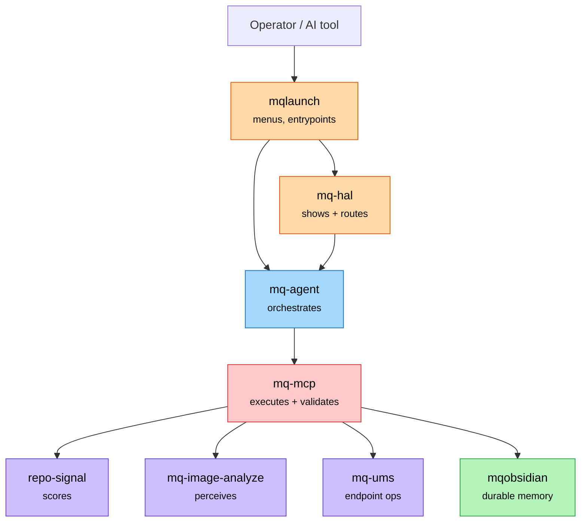
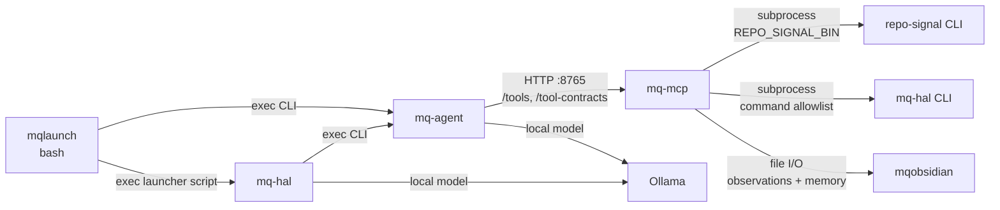
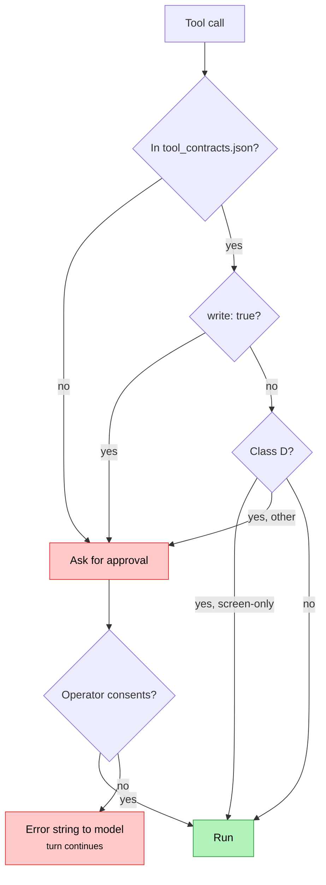

# MQ stack — system description

What each component is, how they actually reach each other, and where the
safety boundary sits. Complements [mq-stack.md](mq-stack.md), which maps the
memory loop; this document maps the **control path and the call mechanics**.

Every relationship below was read from current source or generated contracts on
2026-09-19, not from prior documentation. Verification commands are in the last
section. Runtime truth still lives in each source repo.

## 1. Components

| Component | Version | Owns | Does not own |
|---|---|---|---|
| `macos-scripts` / `mqlaunch` | 2.2.0 | terminal menus, workflow entrypoints | cross-repo memory |
| `mq-hal` | 2.5.0 | operator-state summaries, routing display | stack gates, release decisions |
| `mq-agent` | 1.28.0 | orchestration, workflows, stack gates, context export | tool contracts, durable memory |
| `mq-mcp` | 2.1.0 | bounded tool runtime, validation boundary, approved writes | orchestration decisions |
| `repo-signal` | 1.4.2 | repo intelligence, readiness scoring, JSON contracts | durable memory |
| `mqobsidian` | 0.4.0 | durable memory, truth exports, context compression | execution, live runtime state |
| `mq-image-analyze` | 1.5.0 | visual perception → structured context | execution, autonomy |
| `mq-ums` | 0.1.4 | enterprise endpoint workflows (IGEL UMS) | memory curation |

`atlas-core` is deliberately **outside** this stack. Its own README states MQ
must be an optional adapter, never a dependency.

## 2. Control path

How a request travels from a keystroke to an effect.



`mq-hal` shows and routes; it does not decide. `mq-agent` decides what to do;
`mq-mcp` is the only component that executes a tool and the only place a write
is approved.

- Evidence: `mq-hal/README.md` (Operator Role), `macos-scripts/bin/mqlaunch`,
  `mq-agent/README.md`, `mq-mcp/README.md`
- Unknowns: `mq-ums` runs on Windows and its README does not reference the MQ
  stack; the coupling is one-way, through `mq-mcp` tools only.

## 3. How they actually call each other

The transports differ per edge, and that matters more than the boxes: one is a
network hop, the rest are process boundaries.



Verified mechanics:

- **`mqlaunch` is a 29-line shim.** `bin/mqlaunch` execs
  `terminal/launchers/mqlaunch.sh`, or `mqlaunch-repl.sh` when the first
  argument is `repl`, `prompt` or `shell`.
- **`mq-agent` → `mq-mcp` is the only network edge.** `MCPBridge` in
  `mq_agent/tools/mcp_bridge.py` speaks HTTP to `http://localhost:8765` by
  default: `GET /health`, `GET /tools`, `GET /tools/{name}`,
  `GET /tool-contracts`, `POST /tools/{name}`. `MultiMCPBridge` aggregates
  several MCP servers and routes each call to the first bridge exposing that
  tool.
- **`mq-mcp` → `repo-signal` is a subprocess**, not a library import.
  `_run_repo_signal` runs the binary from `REPO_SIGNAL_BIN`, falling back to
  `~/repo-signal/.venv/bin/repo-signal`.
- **`mq-mcp` → `mq-hal` is a subprocess behind a fixed command allowlist**, so
  the direction reverses for reporting: `mq-hal` is both a caller and a callee.

Call density, counted as outbound references in source:

```text
mq-hal   → mq-agent 175 · repo-signal 48 · mqobsidian 44 · ollama 27 · mq-mcp 20
mqlaunch → mq-agent  31 · mqobsidian 16 · mq-hal      6 · ollama  2 · repo-signal 1
```

- Evidence: `mq_agent/tools/mcp_bridge.py`, `mq-mcp/server.py`
  (`_run_repo_signal`, `_resolve_repo_signal_bin`), `macos-scripts/bin/mqlaunch`
- Unknowns: reference counts measure coupling, not runtime frequency.

## 4. The safety boundary

`mq-mcp` is the validation boundary. Every tool carries a machine-readable
class in `docs/tool_contracts.json`, and Bridget's gate reads that file.



As classified today: **130 tools**, of which 108 are `write: false`.

```text
Class A  41   read-only, repo-scoped
Class B  36   read-only, allowed external paths
Class C  21   write-capable, controlled scope
Class D  32   subprocess / open-app
```

Two path resolvers enforce the filesystem boundary: `resolve_repo_file` accepts
only repo-relative paths inside `REPO_ROOT`; `resolve_allowed_local_file` also
accepts absolute paths within `MQ_MCP_ALLOWED_PATHS`. Both reject `../`
traversal.

`mq-mcp/docs/TOOL_SAFETY.md` states that 41 of 130 tools are gated, and that a
denial returns an error string rather than ending the turn — so a refused tool
degrades the answer instead of killing the session.

- Evidence: `mq-mcp/docs/TOOL_SAFETY.md`, `mq-mcp/docs/tool_contracts.json`
  (counts recomputed from the contract file)
- Unknowns: the "41 gated" figure is the document's own claim; it was not
  independently recomputed here.

## 5. Bridget

Bridget is the interactive agent surface, and it lives in **`mq-mcp`**, not in
`mq-agent`:

```text
mq-mcp/mq-mcp/bridge.py            entrypoint, tool dispatch
mq-mcp/mq-mcp/bridget_safety.py    load_safety_map, needs_approval, tool_class
mq-mcp/mq-mcp/bridget_context.py   rolling session memory, ~/.mq/bridget-context.md
mq-mcp/mq-mcp/bridget_runtime.py   runtime state
mq-mcp/mq-mcp/bridget_voice.py     voice commands
mq-mcp/mq-mcp/bridget_workflow.py  workflow steps
```

This places the approval gate in the same process as the tool runtime, which is
why the boundary holds: there is no path from an orchestrator to an effect that
skips it.

- Evidence: file listing under `mq-mcp/mq-mcp/`, imports at the top of
  `bridge.py`, module docstring of `bridget_context.py`

## 6. Memory loop

Not duplicated here. [mq-stack.md](mq-stack.md) is the source of truth for it.
In one line: `repo-signal` and `macos-scripts` produce observations →
`memory/observations/<producer>.observations.jsonl` → human promotion gate →
`mqobsidian` durable memory → compressed task-scoped context back to the agents.

There is no `memory/inbox/` folder; promotion is a human gate, not automatic.

## 7. Boundaries that must not blur

1. `mq-hal` displays and routes. It does not own gates or decisions.
2. `mq-mcp` is the only executor and the only write-approval point.
3. `repo-signal` produces observations, never durable memory.
4. `mqobsidian` is truth, never runtime.
5. `macos-scripts` owns local shell behaviour only.
6. `atlas-core` must keep running with no MQ component present.

## 8. Discrepancies found while verifying

1. The canonical diagram in `mq-stack.md` omits `mq-hal` and `mq-ums` — its own
   "Open questions" section admits this — and omits `mq-image-analyze`
   entirely, which is not yet acknowledged.
2. ~~`mq-mcp/README.md` carries a `version-2.1.0` badge while its Status line
   below says `v2.0.0`.~~ **Fixed 2026-09-19.** The Status line now names
   v2.1.0, and `tests/test_runtime_truth.py` gained
   `test_readme_status_section_names_no_superseded_version` so the prose cannot
   drift behind the badge again. The existing tests only asserted the README
   *mentioned* the current version, which a stale summary satisfies.
3. `mq-ums/README.md` contains no reference to the MQ stack, although `mq-mcp`
   exposes `ums_audit_log` and `ums_command_catalog`. The integration is
   documented only from the mq-mcp side.

## 9. Verification

```bash
# component inventory (versions + indexing)
for r in mq-mcp mq-agent mq-hal macos-scripts mqobsidian repo-signal \
         mq-ums mq-image-analyze; do
  printf '%-18s %s\n' "$r" "$(git -C "$r" log -1 --format=%cs)"
done

# transports
sed -n '1,29p' macos-scripts/bin/mqlaunch
grep -n "localhost:8765\|/tool-contracts" mq-agent/mq_agent/tools/mcp_bridge.py
grep -n "_resolve_repo_signal_bin\|_run_repo_signal" mq-mcp/mq-mcp/server.py

# safety classification
python3 -c "import json,collections;t=json.load(open('mq-mcp/docs/tool_contracts.json'))['tools'];\
print(len(t), dict(collections.Counter(x.get('class') for x in t)))"

# Bridget location
ls mq-mcp/mq-mcp/bridge*.py mq-mcp/mq-mcp/bridget*.py
```
