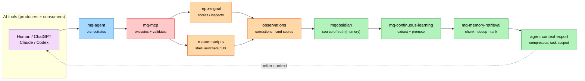

# MQ stack — architecture & memory loop

Whole-system view of the MQ stack: who executes, who validates, who produces
signals, and how durable memory is formed and fed back to agents. Owned by
`mqobsidian` because it describes the **whole stack**, not one repo. Individual
repos may keep their own internal diagrams.

Grounded in [../architecture.md](../architecture.md) and the stack context card
(`memory/context-cards/mq-stack-overview.md`). Runtime truth still lives in each
source repo — verify there before claiming current behaviour.

## Responsibility map

| Component | Owns | Does **not** own |
|---|---|---|
| Human / ChatGPT / Claude / Codex | intent, prompts | truth, execution |
| `mq-agent` | orchestration, execution workflows | tool contracts, durable memory |
| `mq-mcp` | tool execution **and** validation, approved writes | orchestration decisions |
| `repo-signal` | repo intelligence, readiness scoring, JSON contracts, observations | durable memory |
| `macos-scripts` | local macOS shell launchers, terminal UX | cross-repo memory |
| `mq-hal` | operator-state summaries | endpoint workflows |
| `mq-ums` | enterprise endpoint workflows | memory curation |
| `mqobsidian` | durable memory / source of truth | execution, live runtime state |
| `mq-continuous-learning` (skill) | extract → score → promote memory | tool execution |
| `mq-memory-retrieval-engineer` (skill) | retrieval, chunking, dedup, compressed context | writing durable memory |

## Diagram

**Colour = responsibility.** Purple = AI tools · Blue = execution ·
Red = validation boundary · Orange = repo signals / tools · Green = durable memory.

## The loop, in words

1. A human or AI tool states intent.
2. `mq-agent` orchestrates the work; `mq-mcp` executes it and is the validation
   boundary for any approved write.
3. `repo-signal` and `macos-scripts` produce **observations** (repo signals,
   corrections, command output) — they do **not** own memory.
4. Observations are reviewed / decided, sanitized, and exported into
   `mqobsidian` durable memory. There is **no** `memory/inbox/` folder — the real
   surfaces are `memory/observations/<producer>.observations.jsonl`, scoring, and
   the curated learn store (human promotion gate).
5. `mq-continuous-learning` extracts and promotes; `mq-memory-retrieval-engineer`
   retrieves and compresses.
6. Compressed, task-scoped context flows back to the AI tools — better context
   next time.

## Human overview (Excalidraw)

Editable source: [../diagrams/mq-stack-architecture.excalidraw](../diagrams/mq-stack-architecture.excalidraw)
— open in [excalidraw.com](https://excalidraw.com) or the Obsidian Excalidraw
plugin, adjust, and export PNG/SVG next to it if you want a rendered image.

## Boundaries (do not blur)

- `repo-signal` produces observations; it is **not** a durable memory store.
- `macos-scripts` owns local shell/launcher behaviour only.
- `mq-mcp` is the validation boundary for writes.
- `mqobsidian` is the single source of truth for durable memory, not a runtime.

## Verification

This is a structural map, not runtime state. To confirm it still matches reality:

- ownership claims → each repo's `README` / `CLAUDE.md` / `AGENTS.md`
- memory surfaces → `mq-continuous-learning` skill + `schemas/memory-observation.v1.json`
- stack truth → `memory/context-cards/mq-stack-overview.md`

## Open questions

- `mq-hal` and `mq-ums` are shown as owners but not yet in the main visual flow;
  add them if the diagram's scope grows beyond the memory loop.
